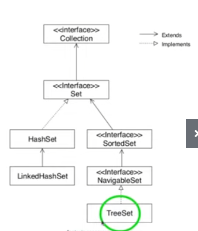

###Set em java 
##Características a interface set
Fica dentro da java.util.Set
não permite elementos duplicados pois é um conjunto, logo tbm não possui índice

##Como e quando utilizar o HashSet, LinkedHashSet e treeSet
treeSet implementa navigableSet e SortedSet - usamos bastante para fazer ordenação
Hashset implementa interface Set diretamente e a linkedHashSet ié uma extensão de HashSet

- Hashset
implementa HashMap
não tem ordem
Melhor performance
Permite 1 elemento null

- LinkedHashset
implementa linkedHashMap
tem ordem como uma lista
Media Performance
Permite 1 elemento null

- TreeSet
implementa treeMap
tem ordenação natural - String(Alfabética), Int(numérica)
Menor Performance
Não permite nehum elemento null

##Conhecer os principais métodos
Ver Exemplos