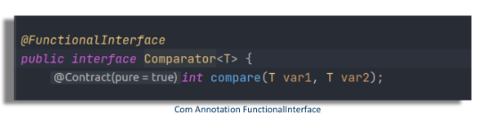
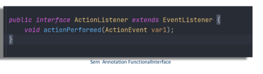
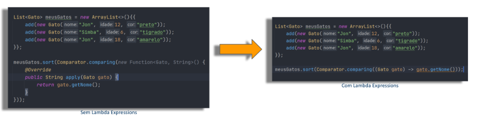
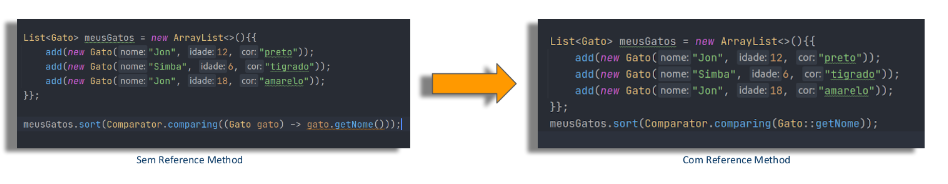
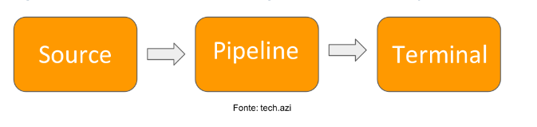

# Trabalhando com Stream API - Visão Geral

## Objetivos: Entender dentre outras coisas:
1. Clase anônima

    A classe anônima é uma classe que não recebeu um nome e é tanto declarado e instanciado em uma única instrução.

    Voce deve  considerar o uso de uma classe anônima sempre que vc precisa para criar uma classe que será instanciada apenas uma vez.

   Por exemplo, quando criamos a lista de gatos e criamos a classe de comparator que ensina ao java qual deve ser o arqgumento utilizado para comparar e conseguir ordernar um grupo de elementos gato que neste caso, foi pela idade.
>     List<Gato> meusGatos =new ArrayList<>(){{
>        add(new Gato("Jon", 18, "preto"));
>        add(new Gato("Simba", 6, "tigrado"));
>        add(new Gato("Jon", 12, "amarelo"));
>     }};
>     System.out.println("Imprimindo na ordem idade antes: "+ meusGatos);
>     //Collections.sort(meusGatos, new ComparatorIdade());//utilizando a interface comparator que é implementada em outra classe ComparatorIdade
>     //ou tbm dá pra usar meusGatos.sort(new ComparatorIdade()):
>     meusGatos.sort(new ComparatorIdade()):
>     System.out.println(meusGatos);

>     class ComparatorIdade implements Comparator<Gato>{
>        @Override
>        public int compare(Gato o1, Gato o2) {
>           return Integer.compare(o1.getIdade(), o2.getIdade());
>        }
>     }

Quando utilizamos classes anônimas, não precisaríamos  criar uma classe Comparator idade, 
pois só vamos usá-la uma única vez, em vez disso a declaramos e instanciamos em uma única instrução, como mostrado abaixo.
Veja que a classe anônima é passada como argumento Comparator para o método sort

>     List<Gato> meusGatos =new ArrayList<>(){{
>        add(new Gato("Jon", 18, "preto"));
>        add(new Gato("Simba", 6, "tigrado"));
>        add(new Gato("Jon", 12, "amarelo"));
>     }};
>     System.out.println("Imprimindo na ordem idade antes: "+ meusGatos);
>     //Collections.sort(meusGatos, new ComparatorIdade());//utilizando a interface comparator que é implementada em outra classe ComparatorIdade
>     //ou tbm dá pra usar meusGatos.sort(new ComparatorIdade()):
>     meusGatos.sort(new Comparator<Gato>(){
>        @Override
>        public int compare(Gato o1, Gato o2) {
>           return Integer.compare(o1.getIdade(), o2.getIdade());
>        }
>     });
>     System.out.println(meusGatos);

Veja que a classe anônima é uma classe pequena que não tem getters/setters ou construtores o que mostra ainda mais a característica de ser uma classe que não precisa ter nome pois será instanciada uma única vez

2. Funcional Interface

   A funcional interface é qualquer interface com um SAM(single Abstract Method) e sua implementação pode ser tratada como expressões **lambda**

   

   O método Comparator é uma funcional Interface, pois só tem um método abstrato(SAM)
   O Comparator até tem outros métodos, mas abstrato é apenas essa.
   Nem todos os métodos desse tipo tem a anotação de @FuncionalInterface como o ActionListener

   

   Nessa aula de Stream API conheceremos as SAM
   
   - Comparator
   - Consumer
   - Function
   - Predicate
 
3. Lambda

   Uma função lambda é uma função sem declaração, isto é, não é necessário colocar um nome, um tipo de retorno e o modificador de acesso. 
   A ideia é que o método seja declarado no mesmo lugar que será usado. As funções lambda em Java tem a sintaxe definida como (argumento) -> (corpo)
   É meio que uma forma de simplificar uma classe anônima.
Por exemplo:

   
 
Function é a classe anônima(declarad uma única vez) que manda um objeto gato e retorna uma string **new Function<Gato,String>(){...}** que só tem uma única função **public String apply(Gato gato){...}** que retorn a variável nome do Gato.

4. Reference Method

   É um novo recurso do Java 8 que permite fazer a referência a um método ou construtor de uma classe( de forma funcional) e assim eindicar que ele deve ser uutilizado num ponto específico do código, deixando-o mais simples e legível.
   Para utilizá-lo, basta informar uma classe ou referência seguida do símbolo :: e o nome do método sem os parênteses no final.
   É meio que uma forma de simplificar o lambda

   

5. Stream API

   A Streams API traz uma nova opção para manipulação de coleções em Java seguindo os princípios da programação fucional.
   Combinada com as expressões lambda, ela proporciona uma forma diferente de lidar com conjunto de elemntos, oferecendo ao desenvolvedor uma maneira simples e concisa de escrever código
   que resulta em facilidade de manutenção e paralelização sem efeitos indesejados em tempos de execução.

   

   A fonte é a nossa Collection, o pipeline são opreções intermediárias e no fim operação terminal 

