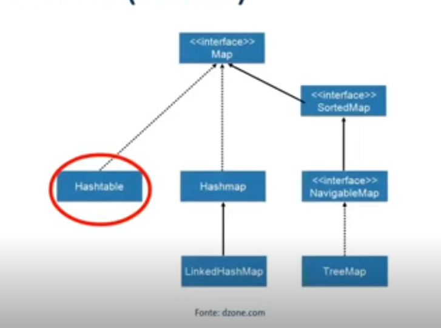
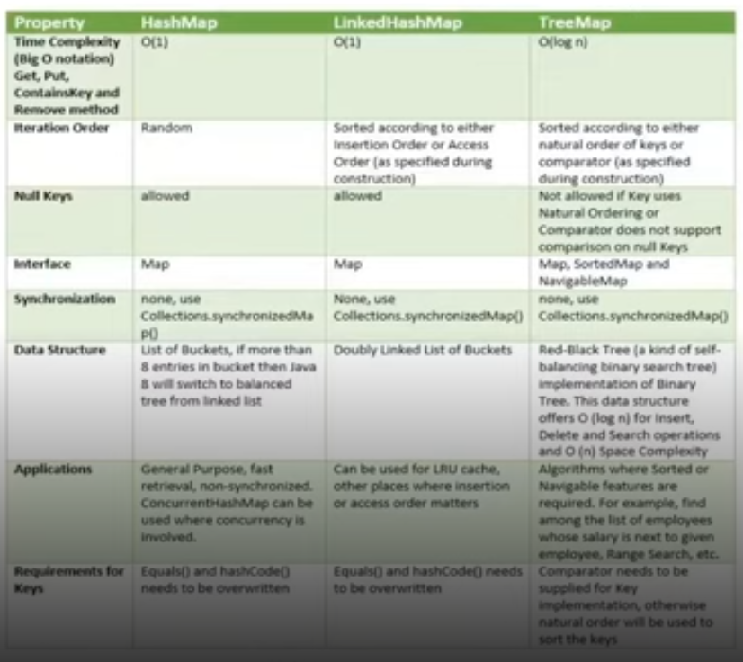

## Interface Map

### 1. Caracterísiticas da interface

    Interface econtrada dentro da java.util.Map
    O map é um pouco diferente de Set e List, pois ele não extend de collection, mas ele é um objeto que podemos colocar outros elementos.
    
 

    Cada elemento tem uma chave(valores únicos) e um valor(pode repetir)

### 2. como e quando utilizar o HashMap, linkedHashMap, TreeHashMap

    Hastable é muito antigo, normalmente não se trabalha com ele
    TreeMap implementa NavigableMap e  SortedMap Devemos usar para ***ORDENAÇÃO*** 
    
Como Pode-se ver pelo BigO Notation o HashMap e o LinkedHashMap têm a mesma performance que é melhor do que o TreeMap
- O HashMap itera randomicamente, o LinkedHashMap itera de acordo com a ordem de inserção das Chaves e o TreeMap de acordo com a ordem definida como ***Natural***
- Chaves Nulas são permitidas apenas para o HashMap e o LinkedHashMap, até pq não tem como ordenar com o Null como parâmetro da Chave
- Perceba que HashMap e LinkedHashMap implementam apenas a interface Map, já TreeMap implementa a mais o NavigableMap e o SortedMap
- Nenhum deles é sincronizável, mas podemos utilizar da classe collections o Collections.synchronizedMap()
- A estrutura e dados tem por baixo é uma list of bucket para o HashMap, uma double list of bucket para o linkedHasMap e uma árvore para o TreeMap
  A bucket data structure is a data structure that uses the key values as the indices of the buckets, and store items of the same key value in the corresponding bucket. Naturally it makes the most sense to use the bucket data structure with integer key values.

Suppose B is a bucket data structure such that bucket B[x] stores all items with the key value of x.

Using the Shortest Paths problem as the example, if you have 3 nodes u, v and w in the Frontier set, where the currently known shortest distances are 3, 3 and 7, respectively, then B[3] = {u, v} and B[7] = {w}.

Time analysis of the bucket data structure that is relevant to the Shortest Paths problem:

Insert: O(1)
Removal: O(1)
Decrease Key: O(1)
Find Minimum: O(c), where c is the maximum key value.
Thus if Dijkstra's algorithm is implemented with a bucket data structure, you have O(m + nc) for your total time complexity, where m is the number of edges and n is the number of nodes.

A double bucket data structure, in most cases, refers to the bucket data structure where each bucket contains a bucket data structure.

### 3. Conhecer os principais métodos
Resolver os Exercícios
