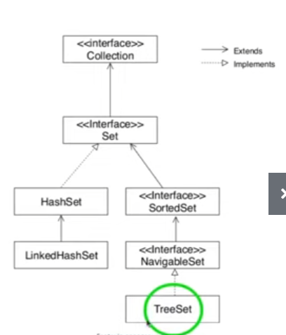

###Set em java 
##Características a interface set
Fica dentro da java.util.Set
não permite elementos duplicados pois é um conjunto, logo tbm não possui índice

##Como e quando utilizar o HashSet, LinkedHashSet e treeSet
treeSet implementa navigableSet e SortedSet - usamos bastante para fazer ordenação
Hashset implementa interface Set diretamente e a linkedHashSet ié uma extensão de HashSet

- Hashset
implementa HashMap
não tem ordem
Melhor performance
Permite 1 elemento null

- LinkedHashset
implementa linkedHashMap
tem ordem como uma lista
Media Performance
Permite 1 elemento null

- TreeSet
implementa treeMap
tem ordenação natural - String(Alfabética), Int(numérica)
Menor Performance
Não permite nehum elemento null

##Conhecer os principais métodos
Ver Exemplos

##Exercícios Propostos

Crie um conjunto contendo as cores do arco-íris e:

Exiba todas as cores uma abaixo da outra

A quantidade de cores que o arco-íris tem

Exiba as cores em ordem alfabética

Exiba as cores na ordem inversa da que foi informada

Exiba todas as cores que começam com a letra ”v”

Remova todas as cores que não começam com a letra “v”

Limpe o conjunto

Confira se o conjunto está vazio

Exercícios Propostos

##Crie uma classe LinguagemFavorita que possua os atributos
nome, anoDeCriacao e ide. Em seguida, crie um conjunto com
3 linguagens e faça um programa que ordene esse conjunto
por:

Ordem de Inserção

Ordem Natural (nome)

IDE

Ano de criação e nome

Nome, ano de criacao e IDE

Ao final, exiba as linguagens no console, um abaixo da outra.