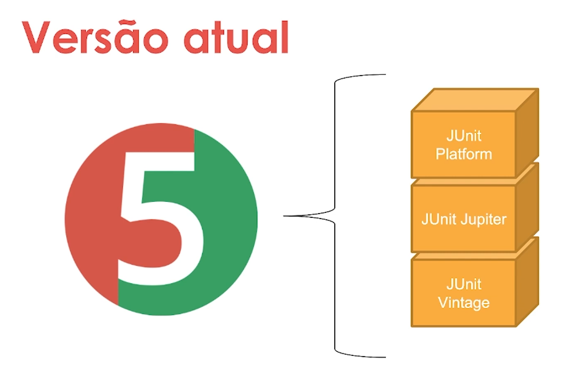

# Testes com Junit

Objetivos do curso

Entender: 
- o porquê devemos escrever testes unitários

Conhecer:
- O que é Junit?
- Como configurar a ferramenta?
- Como utilizar nos seus projetos Java?
- Como aprofundar nos recursoss que ela provê para construir testes unitários efetivos?

Aula1- por que escrever testes unitários?

Podemos chamar testes unitários de testes de unidade ou seja a menor unidade de código possível, uma função/método/classes.
Testes unitários é um conceito bem amplo, para o Java temos o Junit e para outras linguagens temos outros vários tipos.
São testados aqueles microcomponenentes para unidos representarem aquelas features do código. Os testes devem ser escritos em tempo de desenvolvimento,
ou seja durante a codificação de um novo componente do projeto.

Um Exemplo Simples que pode nos dar um norte é

    class Pessoa{
    //Construtor, atributos e métodos

        public boolean ehMaiorDeIdade{
            return idade>18;
        }
    }

    classe PessoaTeste{ //padrão NomeDaClasseTeste
        
        @Teste //Passada como tag pelo java para testes
        void validaVerificacaoDeMaiorIdade(){
        {
            Pessoa joaozinho = new Pessoa("João", LocalDate.of(2004,1,1));  //criada instância de Pessoa com o nascimento em 2004, logo é maior de idade.
            Assertions.assertTrue(Joaozinho.ehmaiorDeIdade());              //valide para mim se joãozinho é maior de idade
        }
    }

Algumas situações nos mostram o porquê de escrever o testes unitários:

- Vc chegou em um projeto que já está em desenvolvimento, rodar uma switch de testes dá uma visão funcional do que o código deve fazer.
- Se vc escreve testes para validar um comportamento, é mais fácil vc entender qual o comportamento esperado.
- Quando se tenta corrigir um bug no sistema, não queremos que este ajustes cause novos bugs. Umas das formas de se evitar é escrever um caso de testes para aquele bug e ajustar a aplicação para que aquele cenário de bug não aconteça mais, mas que não se introduza novos bugs na aplicação.
- Da mesma forma na refatoração do código, devemos ter muita ciência que não teremos problemas com a melhoria feita.
- É preciso sempre tentar entregar com segurança novas features. Não é sufuciente apenas testarmos na nossa máquina

Ainda podemos falar em :

- Pirâmide de testes
  - O teste unitário é o método mais barato que existe para realização de testes. Quando escrevemos testes unitários temos certeza do comportamento do nosso sistema.
  - A cobertura de testes é uma unidade de meedida de qualidade de software, quão mais coberto for temos mais certeza de que a nossa aplicação está mais próximo do que o nosso cliente deseja.
  - É possível automatizar essa execução de testes, o que nos permite olhar com mais atenção da qualidade do sistema.
  - A cultura de agilidade que envolve os times que trabalham com metodologia ágil com timeboxes mais compactos 

Resumo <https://imasters.com.br/devsecops/testes-unitarios-qual-a-importancia>

A qualidade de um software não pode ser avaliada em um produto já feito. Então como escrever softwares com qualidade que possa ser atestada?
Com testes Unitários isso é possível, com o auxílio de por exemplo TDD - "Test-Driven Developement" onde conseguimos detectar falhas no fluxo de informações do produto que está sendo criado para reparar os erros básicos que podem interferir na execução correta da aplicação.

Aula2- Hello World no Junit

A versão Atual é a 5 uqe não é utilizada amplamente no mercado, ainda temos a versão 4 sendo usada no mercado.

O Junit5 é composto pelos módulos:

- Junit Plataform:
  - É o componente que executa os testes(motor de execução)
- JunitJupiter
  - Onde fica todas as classes, anotations
- Junit Vintage
  - É um motor para fazer integrações com as versões mais antigas do Junit

Como configurar o Junit?

- Versão do Maven

Aula3- Aprofundando nos recursos

O que é o básico para testar?

    //Maven
    @Test //Anotação @Test
    void validarCalculoDeIdade(){ //void com nome descritivo do que se está testando
        Pessoa pessoa = new Pessoa("Julia", LocalDate.of(2020,1,1));
        Assertions.assertFalse(pessoa.ehMaiorDeIdade()); //verificar o retorno como falso

        Pessoa marto = new Pessoa("Julia", LocalDate.of(2020,1,1));
        Assertions.assertFalse(pessoa.ehMaiorDeIdade()); //verificar o retorno como Falso

        Pessoa marta = new Pessoa("Marta",LocalDate.of(1995,1,1));
        Assertions.assertTrue(marta.ehMaiorDeIdade()); //verificar o retorno como Verdadeiro

        List<Pessoa> pessoas = List.of(new Pessoa("Julia", LocalDate.now()), new Pessoa("Maria", LocalDate.now()));

        Assertions.assertAll("pessoas",
                ()-> Assertions.assertFalse(pessoas.get(0).ehMaiorDeIdade()),
                ()-> Assertions.assertFalse(pessoas.get(1).ehMaiorDeIdade())
        );

    }
    
    @Test //Anotação @Test
    void deveValidarCalcularIdade(){ //Anotação @Test
        Pessoa jessica = new Pessoa("Jessica",LocalDate.of(2000,1,1));
        Assertions.assertEquals(22,jessica.getIdade()); //quando eu chamar getIdade deve retornar / eu espero = 22

    }

Explorando a classe Assertions

    package one.digitalinnovation.junit;
    
    import org.junit.jupiter.api.Assertions;
    import org.junit.jupiter.api.Test;
    
    
    // Podemos importar o Assertion commo static para não precisarmos colocar sempre o Assertion no início de cada teste
    //Podemos importar assim
    //import static org.junit.jupiter.api.Assertions.assertArrayEquals;
    //import static org.junit.jupiter.api.Assertions.assertEquals;
    //import static org.junit.jupiter.api.Assertions.assertNull;
    //ou todos de uma vez com *
    //import static org.junit.jupiter.api.Assertions.*;
    
    public class AssertionsTeste {
    
        @Test
        void validadeDeLancamentos(){
    
            int[] primeiroLancamento =  {10,20,30,40,50};
            //int[] segundoLancamento =   {-1,5,2,3,10,16,17}; erro pela qtde de itens diferentes
            //int[] segundoLancamento =   {-1,5,2,3,10};// Erro Expected :10 Actual   :-1 //array contents differ at index [0]
            //int[] segundoLancamento =   {10,5,2,3,10};//Expected :20 Actual   :5 //array contents differ at index [1]
            //int[] segundoLancamento =   {10,20,30,40,50}; com os mesmos valores dá certo
            int[] segundoLancamento =   {10,20,30,40,50};
            //Assertions.assertNotEquals(primeiroLancamento,segundoLancamento); //se forem diferentes, mesmo com números distintos de valores
            Assertions.assertArrayEquals(primeiroLancamento,segundoLancamento); //se forem iguais
        }
        @Test
        void validarSeObjetoEstaNulo(){
            Pessoa pessoa = null;
            Assertions.assertNull(pessoa); //verifica se a referência é nula
            //Assertions.assertNotNull(pessoa); //verifica se a referência é nula
        }
        @Test
        void validarNumerosDeTiposDiferentes(){
            double valor = 5.0;
            double outroValor = 5.0;
            Assertions.assertEquals(valor,outroValor);
        }
    
    
    
    }

### After e Before

## Aula4- Recursos de testes nas IDEs
## Aula5- Boas Práticas

- Busque simplicidade: Nomes que facilitem entender o que vc está fazendo
- Busque a facilidade da leitura dos testes

- Procure testar cedo - TDD
- Busque padronização - Manter o nome das classes
- Testes devem ser determinísticos - não podem ficar falhando e funcionando sem que se mexa

### Automatize 
Ferramentas como Jacoco

Aula6- Conclusão
