# Orientação à objetos

## INTRODUÇÃO
PE VS POO

O Paradigma Estruturado tem uma representação mais simplista ou mais limitada, já a orientada a objetos tem representações mais realistas, se aproximando muito mais da realidade.

O PE foca em operações(funções) e dados ou seja como fazer, já o POO foca na modelagem de entidades e nas interações entre estas, ou seja o que fazer.

Quanto mais alto nível a programação se torna mais fácil o que facilita na construção do código.

**Vantagens da POO**

- Melhor Coesão - Conceito inerente a programação de todos os tipos, assim como uma redação todas as ideias devem trabalhar em conjunto, logo as unidades de código devem ter responsabilidades bem definidas.
- Melhor Acomplamento - Conceito da programação como um todo - a POO permite que se faça da melhor forma possível 
- Diminuição do Gap Semtântico - è uma diferença de uma representação mundoRealXmundoComputacional - devidos às limitações as PE tem um gap muito maior 
- Coletor de lixo - GarbageCollector - A medida que vamos programando e o sistema vai trabalhando as linguagens de POO tem mecanismos que vão limpando a memória com dados que não se utilizarão mais na execução. No PE, o próprio programador que tem de ficar analisando constantemente se a memória está perto de esgotar para liberar mais memória.

Em resumo:

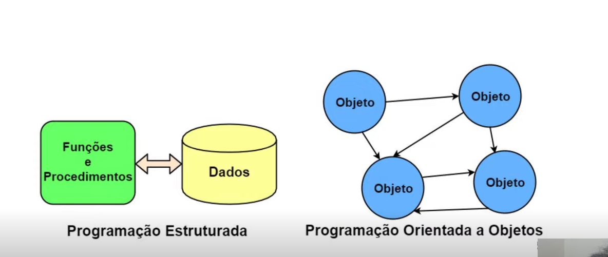

Os objetos são entidades do mundo real que se relacionam, de acordo com a forma na qual as estruturas se interligam.

## FUNDAMENTOS

O que é OO?

A orientação a objetos é um paradigma de análise, projeto e programação de sistemas de software baseado na composição e interação entre diversas unidades de software chamadas objetos.

Para programar em OO, devemos dominar alguns pilares dentre eles:

- **ABSTRAÇÃO** - Processo pelo qual se isolam características de um objeto considerando os que tenham em comum certos grupos de objetos

Por exemplo, para cadeiras podemos pensar em 3 coisas

pernas, assento e encosto 

Várias cadeiras podem ter esses parâmetros como cadeiras de praia, de aula, de cozinha, mas se pensarmos em um braço nem todas cadeiras têm, por exemplo a de praia e a de aula talvez tenham , mas a de cozinha muito provavelmente não terá.

- **REUSO** - É a capacidade de criar novas unidades de código a partir de outras já existentes

Por exemplo, como vemos acima o reuso dos parâmetros da definição de uma cadeira. Na POO, há várias maneiras além da abastração de se garantir o reuso.

- **ENCAPSULAMENTO** - Capacidade de esconder complexidades e proteger dados 

Evitar o acesso de maneira indevida a determinadas partes do código de maneira muito facilitada.

Para garantir o uso destes 3 pilares, muitos outros conceitos virão, mas com estes 3 conceitos básicos já resumem o necessário para usar em qlq linguagem de programação.

### Exercício- Levando em consideração uma loja online de livros, modele uma entidade livro.

1) Separando as características:

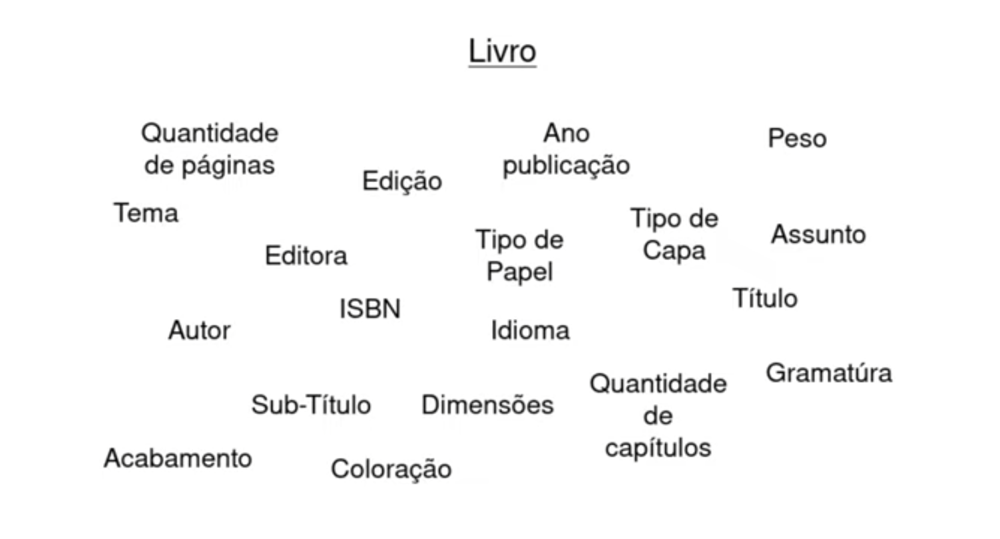

Temos muitas e cada uma delas nos ajuda a definir qual livro estamos tratando. Porém, são muitos detalhes, devemos então diminuir para deixar caracterísitcas mais gerais que possam ser realmente utilizados numa aplicação de loja online.

2) Diminuindo as caracterísitcas 

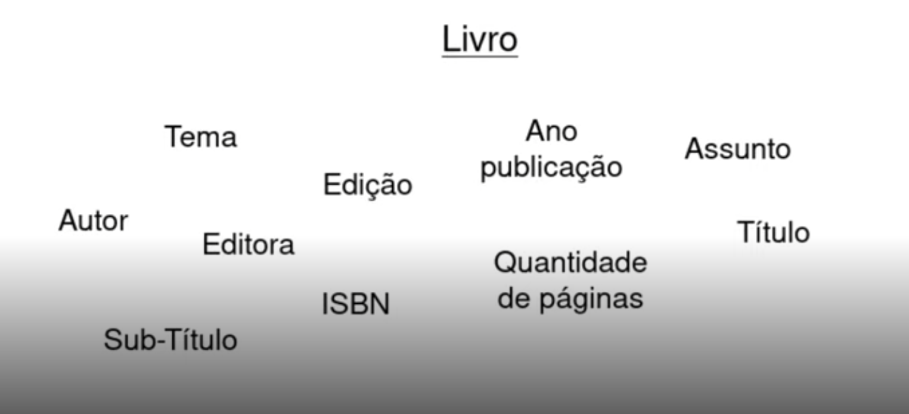

Tiramos detalhes como gramatura, cor do papel, quem quer comprar um livro normalmente não busca essas caracterísiticas.

Mas, se pensarmos no lado , por exemplo da editora caracterísitcas como essas(gramatura, peso e colcoaração do papel) são muito importantes então as caracterísitcas deveriam ser diminuidas para:

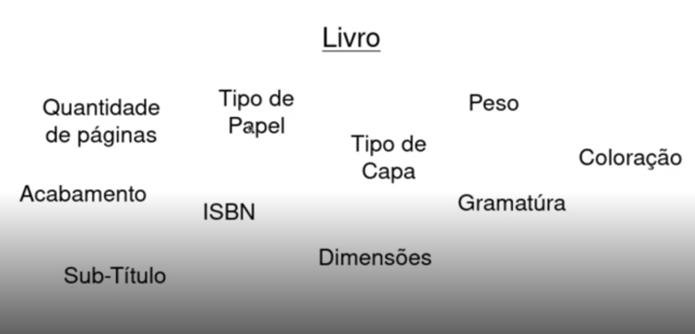

Então, a necessidade da modelagem que está sendo feita influencia diretamente nos atributos que precisamos definir para modelar a entidade.

3) Finalizando a proposta

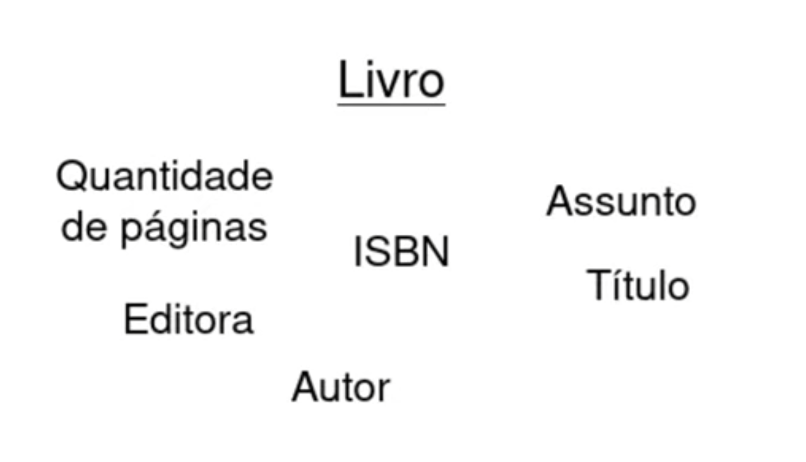

Em resumo, podemos deixar desse jeito. Quando vamos programar um SW devemos nos preocupar com as necessidades que temos hj, se pensarmos muito no futuro desenvolveremos coisas que talvez nem usemos. Em resumo, vai se gastar muito tempo e dinheiro em coisas desnecessárias.

É muito comum que os SW vão se desenvolvendo com o tempo, pois com o tempo acaba se entendendo cada vez mais as regras de negócio.

## ESTRUTURA

Nessa aula, será apresentado os conceitos que criam as estruturas básicas da OO;
TUdo na OO começa a partir destes conceitos.

### - Classe: 

Embora o nome do paradigma seja orientação a objetos, na verdade tudo começa com uma classe que é uma unidade mínima e básica.

Classe *é uma estrutura que abstrai um conjuntode objetos com caracterísiticas similares.* Uma classe define o comportamento de seus objetos através de métodos e os estados possiveis deste objetos através de atributos.
Em outros temos, uma classe descreve os serviços providos por seus objetos e queis informações eles podem armazenar.

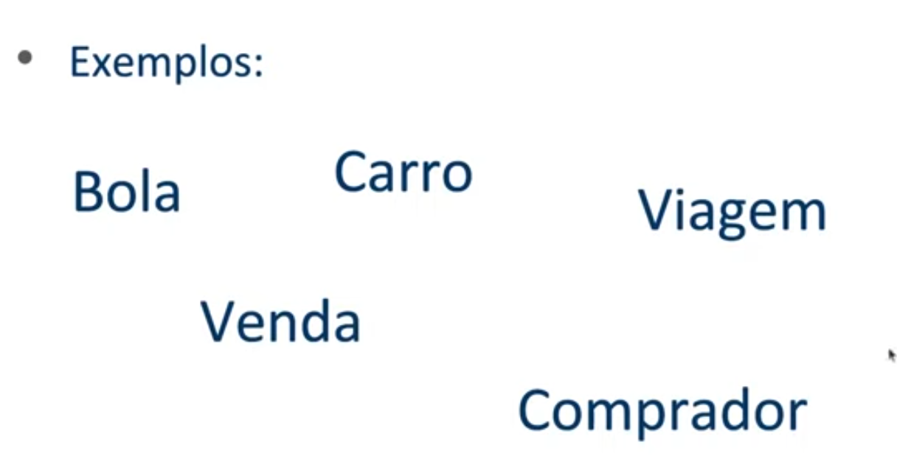

Entidades concretas e abstratas são representadas pelas classes.

#### Dicas na criação das clases:

- Substantivos
- Nomes significativos 
- Contexto deve ser considerado

Por exemplo, pessoa é uma entidade que existe em muitos sistemas e é extremamente genérico. 
Se pensarmos em um sistema de uma loja Pessoa pode ser melhor representada pela Entidade Cliente. 
Numa escola, Pessoa pode ser Aluno, Professor etc, mesmo que pessoa seja mais geral, mas o contexto deixa claro que devemos ser mais específicos neste cado.

Código

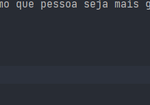

### Exercicio - crie a classe Carro

### - Atributo

É o elemento de uma classe responsável por definir (caracterizar o conceito do mundo real) sua estrutura de dados. O conjunto destes será responsável por representar suas caracterpisticas e fará parte dos objetos criados a partir da classe

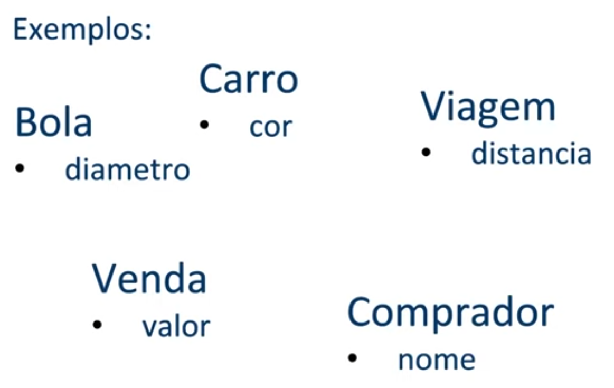

### Atributo X Variável

A: O que é próprio e peculiar a aluém ou a alguma coisa

V: Sujeito a variações ou mudanças que pode variar, incostante e instável.

#### Dicas na criação dos atributos:

- Substantivos e adjetivos
- Nomes significativos
- Contexto deve ser considerado
- Abstração - limitar o necessário
- Tipos Adequados 

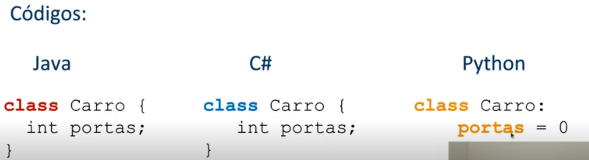

### EXERCÍCIO2

Defina 3 atributos de um Carro cor modelo e capacidade do tanque

### - Método

É uma porção de código(sub-rotina) que é disponibilizada pela classe.
Este pe executado quando é feita uma requisição a ele.
Um método serve para identificar quais serviçoes, ações, que a classe oferece.
Eles são responsáveis por definir e realizar um determinado comportamento.

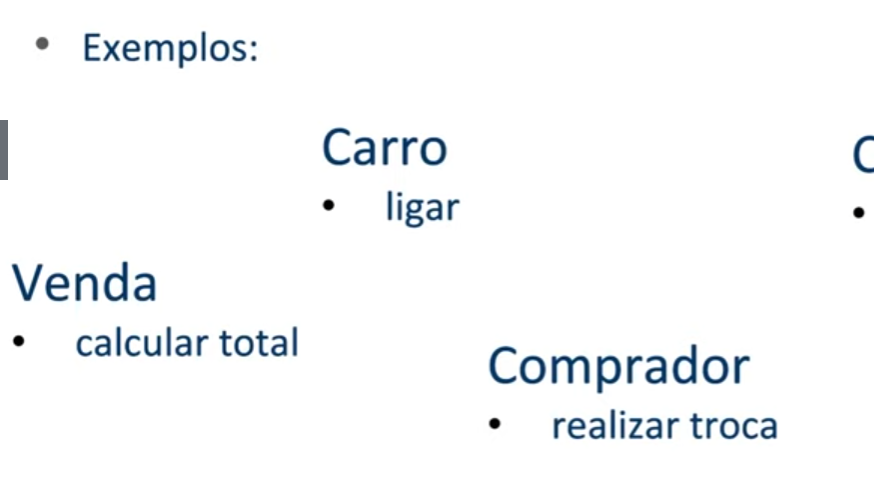

Veja que Bola saiu pq não temos lógica envolvida como métodos para bola

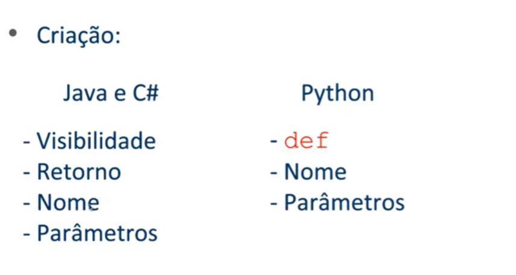

#### Dicas na criação dos atributos:

- Verbos - Ações/Comportamentos
- Nomes significativos
- Contexto deve ser considerado

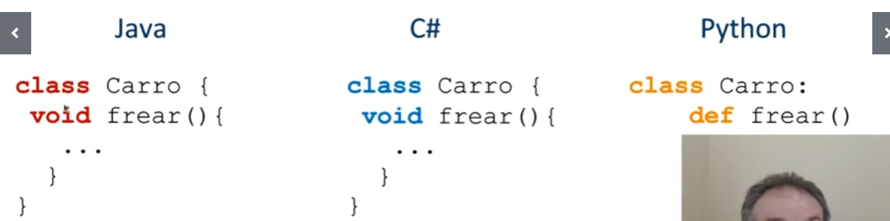

Há dois métodos especiasis que merecem destaque:

- Construtor: Constrói objetos a partir das nossas classes 

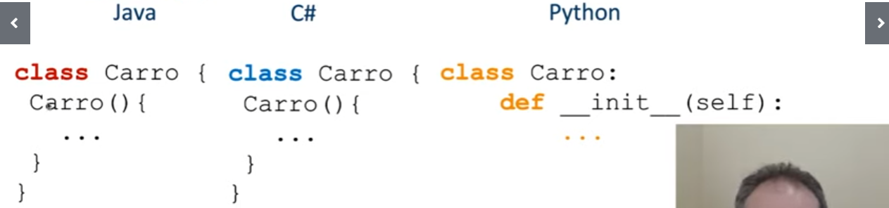

- Destrutor: Auxilia a destruição do objeto  - o proprio garbagecollctor chama o destrutor para liberar recursos

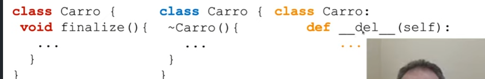

- Sobrecarga - Mudar a assinatura de acordo com a necessidade
    
  Sobrecarga = nome+parâmetros

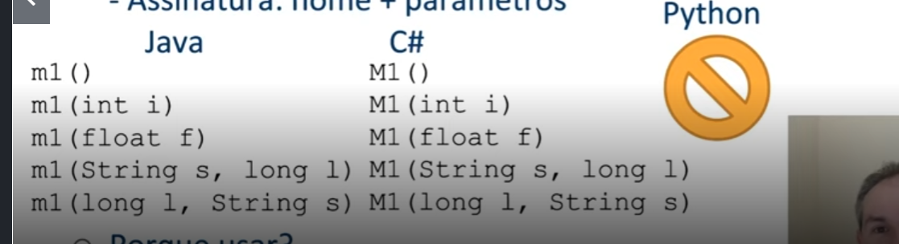

### Exercicio3
Defina 1 método para calcular o valor totral para encher o tanque recebendo o valor da gasolina

- Objeto

Embora o nome do paradigma seja orientação a objetos, primeiro passamos pela classe, atributos e métodos.

Um objeto é a representação de um conceito/entidade do mundo real, que pode ser física(bola,carro, árvore etc.) ou conceitual(viagem, estoque, compra etc.) e possui um significado bem definido para um determinado softwre.
Para esse conceito/entidade, deve ser definida inicialmente uma classe a partir da qual posteriormente serão instanciados objetos distintos.

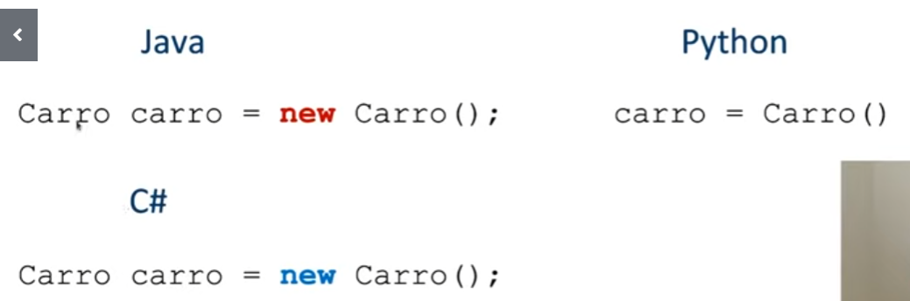

- Mensagem

É o processo de ativação de um método de um objeto.
Isto ocorre quando uma requisição(chamada) a esse método é realizada, assim disparando a execução de seu comportametno descrito pela sua classe, casso a requisição não seja um método estático.

A troca de mensagens entre as entidades é que faz o sistema funcionar. 

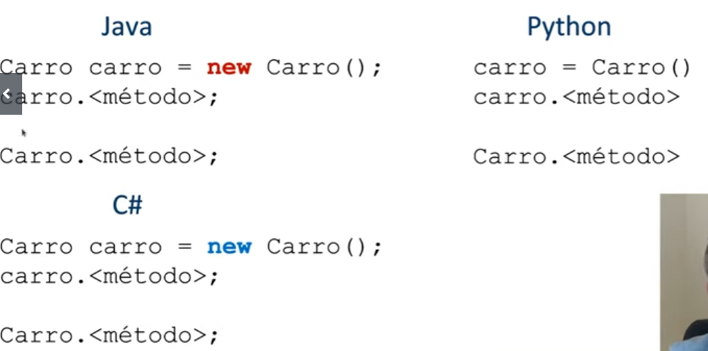

Exercício 4 
Crie Objetos Carro e use métodos set/get para definir valores

